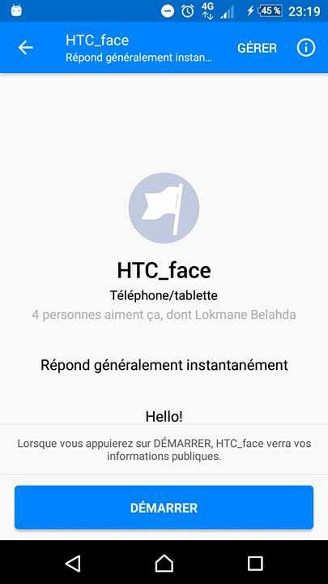
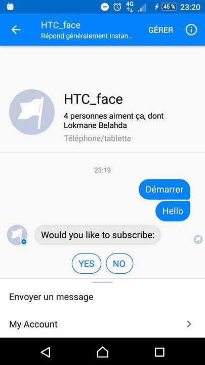
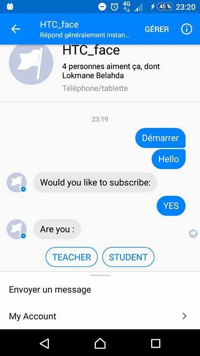
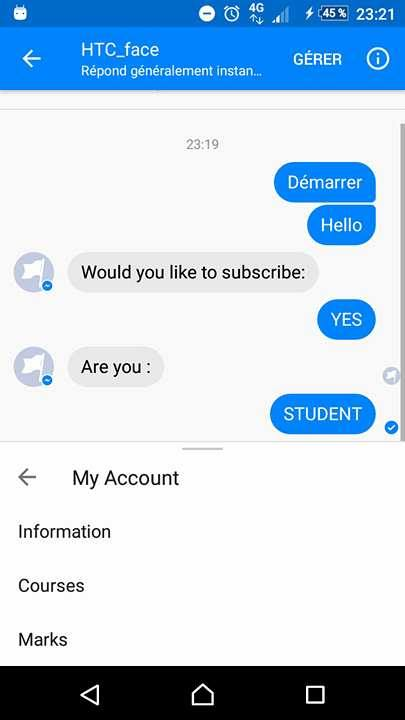

# cli-weather
============

This is a node.js application webhook for facebok messenger, allow you to communicate with your teachers.

;

---

## Features
- ask administration facebook page to add you

---

## Setup
Clone this repo to your server and run `npm install` to install all the dependencies.

You can look into `config.json` to see the Outbuildings.

---

## Usage
After you clone this repo to your server, go to its root directory and run `npm install` to install its dependencies.

Once the dependencies are installed, you can run  `node app.js` to start the application.

---

## ScreenShot of test Application
When you clic in start button and say somthing like hello
the boot ask you to subscribe :
;

---
answer YES. then choose if you are student of teacher
;

---
You can find more options in menu :
;

Teacher can send message for all students:
;

---

## License
>You can check out the full license 	

This project is licensed under the terms of the **MIT** license.